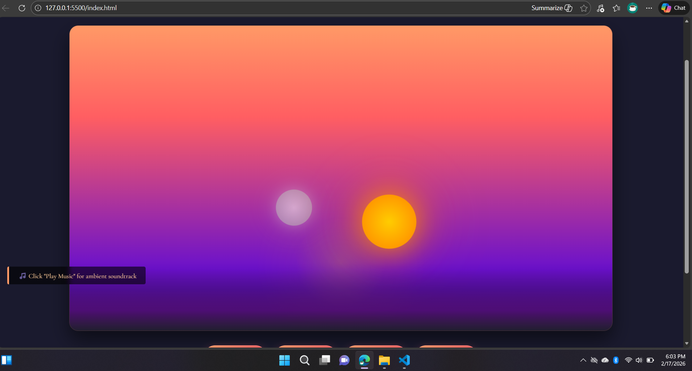

# 🌅 Sunset View Animation  
### Calming Sunset Gradients × Ambient Music Experience

A visually soothing and interactive sunset animation website featuring smooth gradient transitions, calming background music, animated sun & moon, water reflections, and starry skies — built with pure HTML, CSS, and JavaScript.

---

## 📸 Preview

> A relaxing sunset scene with animated gradients, ambient music controls, and smooth visual effects.

---

## ✨ Features

- 🌇 **12 Beautiful Animated Sunset Gradients**
- 🎵 **Calming Ambient Background Music**
- ☀️ Animated Sun & 🌙 Moon Transition
- 🌊 Water Reflection Effects
- ✨ Toggleable Star Animation
- 🎛️ Speed Controls (0.5x, 1x, 2x)
- 🌈 Gradient Cycle & Random Mode
- 📱 Fully Responsive (Desktop & Mobile)

---

## 🧠 Project Purpose

This project is designed to:
- Create a calming and aesthetic visual experience  
- Demonstrate modern CSS gradient animations  
- Practice JavaScript-based UI interactions  
- Serve as a creative frontend portfolio project  

It is ideal for **relaxation**, **UI inspiration**, and **frontend learning**.

---

## 🛠️ Tech Stack

- **HTML5** — Structure  
- **CSS3** — Animations, gradients & layout  
- **JavaScript (Vanilla)** — Interactivity & controls  

✔ No frameworks  
✔ No external libraries  

---

## 📂 Project Structure

sunset-view-animation/
│
├── index.html
├── style.css
├── script.js
├── screenshot.png
└── README.md

---

## ▶️ How to Use

1. Open `index.html` in any modern browser  
2. Click **Play Music** to start ambient audio  
3. Use control buttons to:
   - Pause / Play animation
   - Change or randomize gradients
   - Toggle stars
   - Adjust animation speed  

---

## 🌍 Live Demo

The project is deployed using GitHub Pages and can be viewed live:

👉 https://vinodkumarjaipal.github.io/sunset-view-animation/

---

## 🎯 Use Cases

- Relaxing visual background  
- Meditation or focus ambiance  
- Frontend animation reference  
- Creative UI showcase  
- Portfolio project  

---

## 👤 Author

**Vinod Kumar Jaipal**  
Frontend Developer • Creative UI Enthusiast  

🌐 GitHub: https://github.com/vinodkumarjaipal  

---

## 📄 License

This project is released under the **MIT License**.  
You are free to use, modify, and distribute it for personal or commercial purposes.

---

## ⭐ Support

If you like this project:
- ⭐ Star the repository  
- 🍴 Fork it  
- 🧠 Use it for learning or inspiration  

Feedback and improvements are always welcome!
